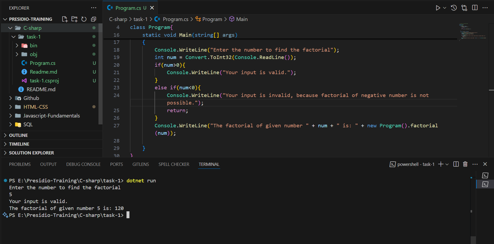

# Basic Data Types, Control Structures, and Methods

- factorial calculation in C# using recursion.

## C# Concepts

- C# is a high level object - oriented Programming language.
- C# compiled ---- convert to ---- `Intermediate language` ---- convert to native code using `CLR` ---- Native.

### C# Data Types

| Type Category           | Data Type |
| ----------------------- | --------- |
| **Primitive Types**     | `int`     |
|                         | `float`   |
|                         | `double`  |
|                         | `char`    |
|                         | `bool`    |
|                         | `byte`    |
|                         | `short`   |
|                         | `long`    |
|                         | `decimal` |
| **Non-Primitive Types** | `string`  |
|                         | `object`  |
|                         | `array`   |

### User input

- `Convert.ReadLine();`
- By default the Input is in the String Format we need to Parse them based on the requirement type.

#### String to Int conversion

```c#
int num = Convert.ToInt32(Console.ReadLine());
```

### Namespaces

- Namespace is a way to logically group `classes`, `interface`, `structs`, `enums`.

- It is used to organize code and prevent the `naming conflicts` by creating a `hierarchy`.

### Control Statements

- `if`, `else if`, `else`, `switch`

### Looping Statments

- `for`, `while`, `do-while`, `foreach`

### Syntax of write the C# code

```C#
using System;
namespace Myapp
{
    public class Program
    {
        static void main(string[] args)
        {
            // programs goes here
        }
    }
}
```

## Factorial Program

```c#
// factorial of the given number

namespace task1{
class Program{

    int factorial(int num){
        if(num == 0 || num == 1){
            return 1;
        }
        else{
            return num * factorial(num - 1);
        }

    }

    static void Main(string[] args)
    {
        Console.WriteLine("Enter the number to find the factorial");
        int num = Convert.ToInt32(Console.ReadLine());
        if(num>0){
            Console.WriteLine("Your input is valid");
        }
        else if(num<0){
            Console.WriteLine("Your input is invalid, because factorial of negative number is not possible");
            return;
        }
        Console.WriteLine("The factorial of given number " + num + " is: " + new Program().factorial(num));

    }
}
}

```

- `class Program` - Declare the Blue print.
- `factorial` - Calculates the factorial of the number using a recursion.
- `static void Main(string[] args)` - Acts a main entry point for the program to execute.
- `Convert.ToInt32` - Convert the string to 32 bit integer.
- `new Program().factorial(num)` - creates a new instance of the Program class(`non static`) and calls factorial method, passing the value num as an argument.

## Output

