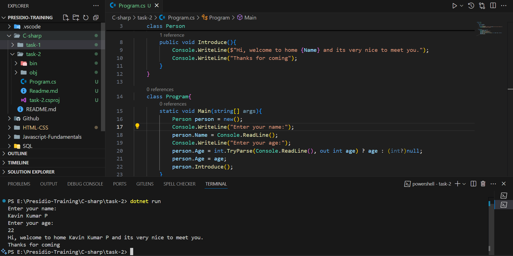

# Simple Object-Oriented Programming

- Created a program to greet the users.

## Concepts learned

- C# variable accepts the nullable value by using `public string? Name` `?` which tells that there be null values are allowed for this variable.

- To Parse the values safely there is a method call `int.TryParse` which handles the exception even through there is a not numeric values are parsed.

- `Person person = new();` - Helps to simplified the form by implicitly create the instance for left side class and this is new update came in c#.

```c#
namespace task2{

    class Person
    {
        public string? Name;
        public int? Age;

        public void Introduce(){
            Console.WriteLine($"Hi, welcome to home {Name} and its very nice to meet you.");
            Console.WriteLine("Thanks for coming");
        }
    }

    class Program{
        static void Main(string[] args){
            Person person = new();
            Console.WriteLine("Enter your name:");
            person.Name = Console.ReadLine();
            Console.WriteLine("Enter your age:");
            person.Age = int.TryParse(Console.ReadLine(), out int age) ? age : (int?)null;
            person.Age = age;
            person.Introduce();
        }
    }
}
```

- Created a `Person` Class with a two properties called `Name` and `Age` which are accessible through instance.
- Created a `Introduce` method for warm greetings.
- In the main Program created a new instance of the Person class for accessing those values from the main.
- Insert the values to that Person class by getting input from user.

## Output


