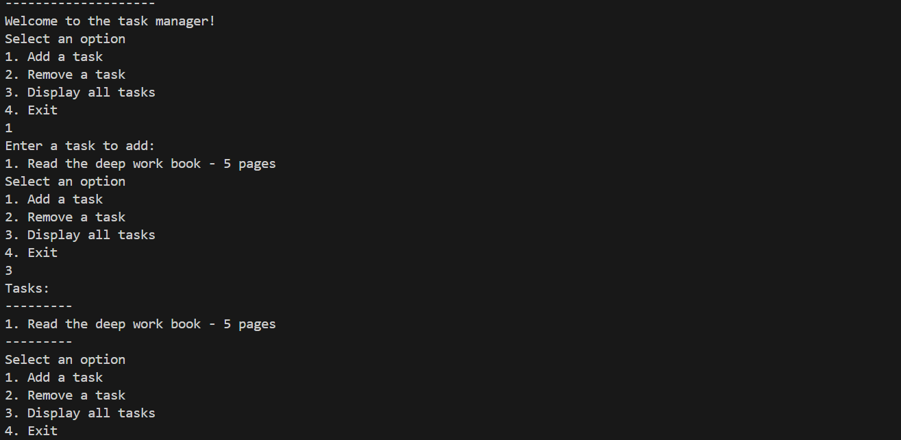
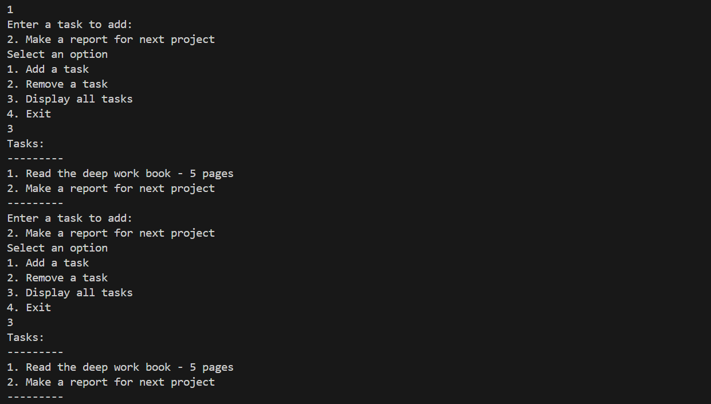
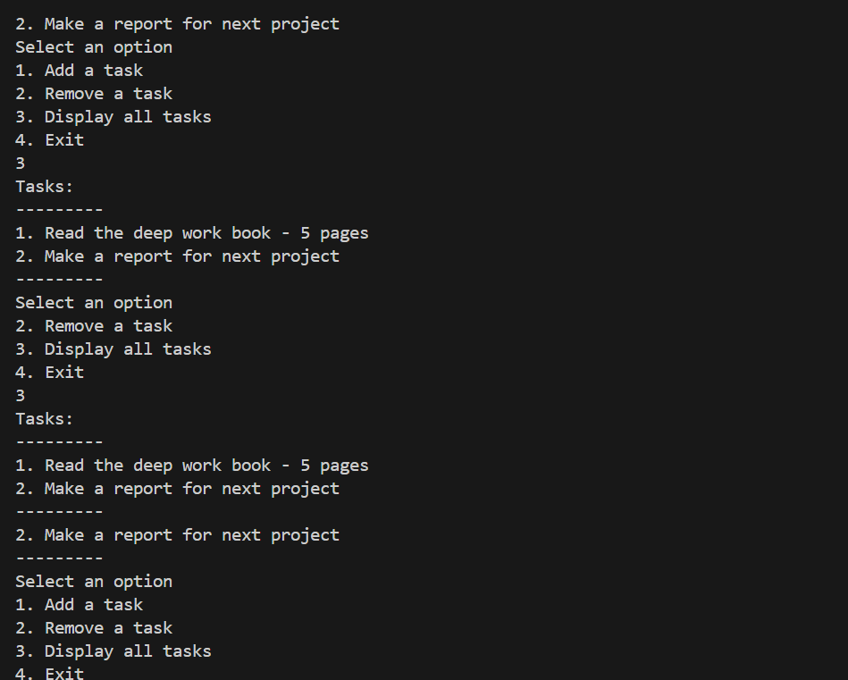
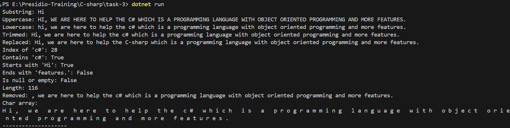

# Basic Collections and String Manipulation

## C# Collection Types

### Non-Generic Collections (not in a safe-type manner)

| **Collection Type** | **Description**                              |
| ------------------- | -------------------------------------------- |
| **Array**           | Fixed-size collection of elements            |
| **Queue**           | First-In-First-Out (FIFO) collection         |
| **Stack**           | Last-In-First-Out (LIFO) collection          |
| **Hashtable**       | Collection of key-value pairs (non-generic)  |
| **SortedList**      | Collection of key-value pairs, sorted by key |

#### Syntax

``` c#
CollectionName variable = new CollectionName();

```

### Generic Collections(type-safe)

| **Collection Type**          | **Description**                                 |
| ---------------------------- | ----------------------------------------------- |
| **List<T>**                  | Resizable list of elements                      |
| **Dictionary<TKey, TValue>** | Collection of key-value pairs (generic)         |
| **Queue<T>**                 | First-In-First-Out (FIFO) collection            |
| **Stack<T>**                 | Last-In-First-Out (LIFO) collection             |
| **HashSet<T>**               | Unordered collection with unique elements       |
| **SortedList<TKey, TValue>** | Key-value collection sorted by key              |
| **LinkedList<T>**            | Doubly linked list of elements                  |
| **ObservableCollection<T>**  | Collection with notifications for changes       |
| **SortedSet<T>**             | Sorted collection with unique elements          |
| **Concurrent Collections**   | Thread-safe collections for multi-threaded apps |

#### Syntax

``` c#
CollectionName<Data type> variable = new CollectionName<Data type>();
```


## List collections

``` c#


namespace task_3{
    class Program{
        static void Main(string[] args){
            var tasks = new List<string>();
            var userDisplay = new string[]
            {
                "1. Add a task",
                "2. Remove a task",
                "3. Display all tasks",
                "4. Exit"
            };
            bool running = true;
            StringHelper.StringMethodsExecution();

            Console.WriteLine("--------------------");
            Console.WriteLine("Welcome to the task manager!");
            while(running){
                Console.WriteLine("Select an option");
                foreach (var item in userDisplay){
                    Console.WriteLine(item);
                }

                string? input = Console.ReadLine();
                switch(input)
                {

                    case "1":
                        Console.WriteLine("Enter a task to add:");  
                        string? newTask = Console.ReadLine();
                        if (!string.IsNullOrEmpty(newTask))
                        {
                            tasks.Add(newTask);
                        }
                        else
                        {
                            Console.WriteLine("Task cannot be empty.");
                        }
                        break;
                    
                    case "2":
                        Console.WriteLine($"Enter the position of the task to remove");
                        if (int.TryParse(Console.ReadLine(), out int index) && index-1 >= 0 && index-1 < tasks.Count)
                        {
                            tasks.RemoveAt(index-1);
                            Console.WriteLine("Task removed successfully.");
                        }
                        else
                        {
                            Console.WriteLine("Invalid index.");
                        }
                        
                    break;

                    case "3":
                        Console.WriteLine("Tasks:");
                        Console.WriteLine("---------");
                        foreach (var task in tasks)
                        {
                            Console.WriteLine(task);
                        }
                        Console.WriteLine("---------");
                    break;

                    case "4":
                        running = false;
                        break;

                }
            }
            
        }
    }
}

```

### Explanation

- Create a Program class and in that Main function is created.
- `var tasks = new List<string>();` - New list is created with a `String` type
- created a string array to store the display message.
- `bool running = true;` - Declare the variable to control the while loop
- `StringHelper.StringMethodsExecution();` - helps to Import the different method from different file under same namespace
- while loop keep on running until the unit exits the system
- if `case is 1` then a input asking for the user to enter the `new tasks`, verify it is not null by `IsNullOrEmpty` and insert the data to list by `tasks.Add(newTask);`
- if `case is 2` then a input is asking for position of the tasks and parse those input using `int.TryParse(Console.ReadLine(), out int index)` and with the help of position remove the task from the list `tasks.RemoveAt(index-1)`
- if `case is 3` - display the list to user using `foreach`.
- if `case is 4` - exist the system by changing the running variable value;


 ### Output
 
 
 
 


## String Manipulation Methods

``` c#
using System;

namespace task_3{
    public class StringHelper{
        public static void StringMethodsExecution(){
            
            string text = "Hi, we are here to help the c# which is a programming language with object oriented programming and more features.  ";

            
            string subString = text.Substring(0, 2);
            Console.WriteLine($"Substring: {subString}");

            string upperText = text.ToUpper();
            Console.WriteLine($"Uppercase: {upperText}");

            string lowerText = text.ToLower();
            Console.WriteLine($"Lowercase: {lowerText}");

            string trimmedText = text.Trim();
            Console.WriteLine($"Trimmed: {trimmedText}");

            string replacedText = text.Replace("c#", "C-sharp");
            Console.WriteLine($"Replaced: {replacedText}");

            string indexOfText = text.IndexOf("c#").ToString();
            Console.WriteLine($"Index of 'c#': {indexOfText}");

            string containsText = text.Contains("c#").ToString();
            Console.WriteLine($"Contains 'c#': {containsText}");

            string startsWithText = text.StartsWith("Hi").ToString();
            Console.WriteLine($"Starts with 'Hi': {startsWithText}");

            string endsWithText = text.EndsWith("features.").ToString();
            Console.WriteLine($"Ends with 'features.': {endsWithText}");

            string nullCheckText = string.IsNullOrEmpty(text).ToString();
            Console.WriteLine($"Is null or empty: {nullCheckText}");

            string lengthText = text.Length.ToString();
            Console.WriteLine($"Length: {lengthText}");

            string removedText = text.Remove(0, 2);
            Console.WriteLine($"Removed: {removedText}");

            char[] charArray = text.ToCharArray();
            Console.WriteLine("Char array: ");
            foreach (char c in charArray)
            {
                Console.Write(c + " ");
            }
            Console.WriteLine();
        }

    }
}
```

### Explanation

-create a another file call `String.cs`and create a class called StringHelper under the `same namespace`.

- create a long sentence and store it in the `text variable`.

- Get the substring from the original text with start and ending index

``` c#
string subString = text.Substring(0, 2);
```

- Get the Upper case of the text.

``` c#
string upperText = text.ToUpper();
```

- Get the lower case of the text.

``` c#
 string lowerText = text.ToLower();
```

- Trimmed the text without any leading white spaces.

``` c#
string trimmedText = text.Trim();
```

- Replaced the `c#` to `C-Sharp` using a `Replace` method.

``` c#
string replacedText = text.Replace("c#", "C-sharp");
```

- Get the first occurrence of the substring `C#` in the text

``` c#
string indexOfText = text.IndexOf("c#").ToString();
```

- Check the substring is present in the original text using `Contains` method.

``` c#
string containsText = text.Contains("c#").ToString();
```

- Verify that the sentence starts with `Hi` using `StartsWith` method.

``` c#
string startsWithText = text.StartsWith("Hi").ToString();
```

- Verify the main text is ended with the word `features` using `EndsWith` method.

``` c#
string endsWithText = text.EndsWith("features.").ToString();
```

- Verify that the main text is null or not using `IsNullOrEmpty`.

```c#
 string nullCheckText = string.IsNullOrEmpty(text).ToString();
```

- Find the total length of the sentence including the white space.

``` c#
string lengthText = text.Length.ToString();
```

- Removed the particular option of the string using the starting and ending index.

``` c#
  string removedText = text.Remove(0, 2);
  ```

- Convert the String in to char Array using a method called `ToCharArray`.

``` c#
 char[] charArray = text.ToCharArray();
 ```

 ### Output

 