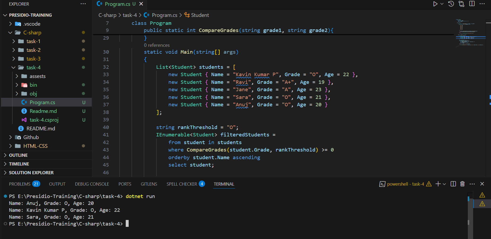

# Working with Collections and LINQ.

## LINQ

- LINQ (Language Integrated Query) is a powerful feature in C# that allows you to query and manipulate data in a declarative way, directly within C# code.
- there are two syntax for LINQ `Query Syntax` and `Method Syntax`

### Query Syntax

``` c#
IEnumerable<Student> filteredStudents = 
                from student in students
                where CompareGrades(student.Grade, rankThreshold) >= 0
                orderby student.Name ascending
                select student;
```

### Method Syntax

``` c#
IEnumerable<Student> filteredStudents = students.
    .Where(student => CompareGrades(student.Grade, rankThreshold)>=0)
    .OrderBy(student=> student.Name)
    .Select(student=>student);
```

## Common LINQ Methods

- `where` - Filters the result based on custom condition.
- `select` - get each element in the data.
- `orderby` - Sort either descending or ascending order.
- `groupby` - grouping the elements by key.
- `from` - begin the LINQ query.
- `Count`, `Sum`, `Average`, `Min`, `Max`, `Aggregate`  - Aggregation methods


## Student management console application

```c#

namespace task_4{
    class Student{
        public string? Name;
        public string Grade { get; set; } = "F";
        public int Age;
    }
    class Program
    {

        public static int CompareGrades(string grade1, string grade2){
            Dictionary<string, int> gradeValue = new()
            {
                {"O", 10},
                {"A+", 9},
                {"A", 8},
                {"B+", 7},
                {"B", 6},
                {"C", 5},
                {"D", 4},
                {"E", 3},
                {"F", 0}
            };

            if(gradeValue.ContainsKey(grade1) && gradeValue.ContainsKey(grade2)){
                return gradeValue[grade1].CompareTo(gradeValue[grade2]);
            }
            else{
                throw new ArgumentException("Invalid grade value");
            }
        }
        static void Main(string[] args)
        {
            List<Student> students = [
                new Student { Name = "Kavin Kumar P", Grade = "O", Age = 22 },
                new Student { Name = "Ravi", Grade = "A+", Age = 19 },
                new Student { Name = "Jane", Grade = "A", Age = 23 },
                new Student { Name = "Sara", Grade = "O", Age = 21 },
                new Student { Name = "Anuj", Grade = "O", Age = 20 }
            ];
            
            string rankThreshold = "O";
            IEnumerable<Student> filteredStudents = 
                from student in students
                where CompareGrades(student.Grade, rankThreshold) >= 0
                orderby student.Name ascending
                select student;

            foreach (var student in filteredStudents)
            {
                Console.WriteLine($"Name: {student.Name}, Grade: {student.Grade}, Age: {student.Age}");
            }
        }
    }
}
```

### Explanation

- `class Student`-  created a Student class with the property of Name, Grade, Age.
- `class Program` - Created a main class Program.
- `public static int CompareGrades(string grade1, string grade2)` - Defined a CompareGrades static method to compare the `string grades` like 'O' or 'A+'.
- `Dictionary<string, int> gradeValue = new()` - Defined a Dictionary to store the string of grades and its values in descending.
- `if(gradeValue.ContainsKey(grade1) && gradeValue.ContainsKey(grade2))` - Compare the keys with the received arguments to calculate the student is received grades above threshold level.
- `static void Main(string[] args)` - Declare the Main method.
- `List<Student> students = []` - Declare the List and add a sample data.
- `string rankThreshold = "O";` - Defined a variable to store the rank threshold.
- `IEnumerable<Student> filteredStudents` - holds the collection of Student objects and supports the iteration.
- `from student in students where CompareGrades(student.Grade, rankThreshold) >= 0` - Begin the linq query with `from` command and pass the student grade and threshold grade to compare function to get the value.
- `orderby student.Name ascending` - Sort the results based on the ascending order in student names.
- `select student;` - Get the each student data collected.
- `foreach (var student in filteredStudents)` - Helps to iterate the filteredStudents with foreach.

## Output

