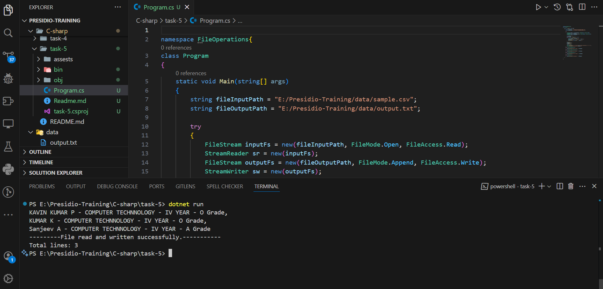
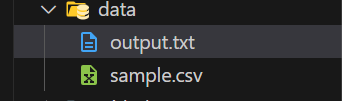
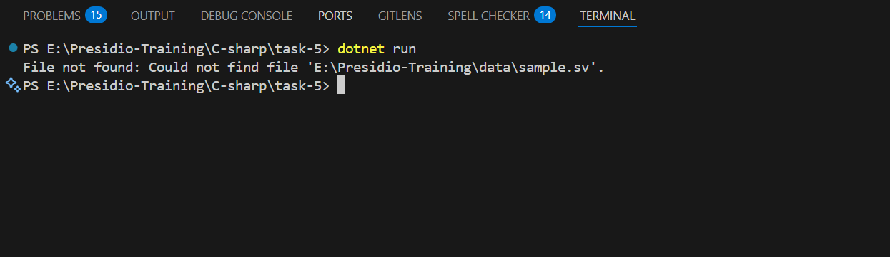

# File I/O and Exception Handling

- Program to read the text from csv file using `FileStream with StreamReader` and write content to text file using `FileStream with StreamWriter`.

## Common System IO classes

- `File` - It provides static methods for file manipulation, such as reading, writing, copying, and deleting files.
- `FileStream` - Used for reading and writing bytes to a file and supports the synchronous and asynchronous operations.
- `StreamReader` - Used to read characters from a byte stream.
- `StreamWriter` - Used to write characters to a byte stream.
- `Directory` - Provides static methods for manipulating directories and its contents.
- `Path` - Used to manipulate the file path string.
- `FileInfo` - Used to gather Information about file size, properties etc,.
- `DirectoryInfo` - Gather Info related to directories and also manipulating the directories.
- `IOException` -  Represents an I/O error which is happened during reading or writing operations.

## Exception handling

- Exception handling is a mechanism in programming that allows you to gracefully handle runtime errors.
- `try` - Defines a block of code to test for exceptions.
- `catch` - Defines a block of code to handle the exception if one occurs.
- `finally` - Defines a block of code that will run regardless of whether an exception occurs or not, typically used for cleanup.
- `throw` - Exception raised by the user explicitly.

## Program

``` c#
namespace FileOperations{
class Program
{
    static void Main(string[] args)
    {
        string fileInputPath = "E:/Presidio-Training/data/sample.csv";
        string fileOutputPath = "E:/Presidio-Training/data/output.txt";

        try
        {
            FileStream inputFs = new(fileInputPath, FileMode.Open, FileAccess.Read);
            StreamReader sr = new(inputFs);
            FileStream outputFs = new(fileOutputPath, FileMode.Append, FileAccess.Write);
            StreamWriter sw = new(outputFs);

            int lineCount = 0;
            string? line;
            while ((line = sr.ReadLine()) != null)
            {
                string[] values = line.Split(',');
                Console.WriteLine($"{string.Join(", ", values)}");
                lineCount++;
                sw.WriteLine($"{string.Join(", ", values)}");
            }

            sw.Close();
            outputFs.Close();
            sr.Close();
            inputFs.Close();

            Console.WriteLine("---------File read and written successfully.-----------");
            Console.WriteLine($"Total lines: {lineCount}");
        }
        catch (PathTooLongException e)
        {
            Console.WriteLine("Path too long: " + e.Message);
        }
        catch (UnauthorizedAccessException e)
        {
            Console.WriteLine("Access denied: " + e.Message);
        }
        catch (FileNotFoundException e)
        {
            Console.WriteLine("File not found: " + e.Message);
        }
        catch (IOException e)
        {
            Console.WriteLine("IO Exception: " + e.Message);
        }
    }
}

}
```

## Explanation

- Above code snippets is used to write a data from input to output file
- two variables are declared - `fileInputPath` and `fileOutputPath` to store the relative path of file.
- `FileStream inputFs = new(fileInputPath, FileMode.Open, FileAccess.Read);` - Pass the input file path and fileMode and access into the FileStream.
- `StreamReader sr = new(inputFs);` - Pass the stream of bytes to the streamReader.
- `FileStream outputFs = new(fileOutputPath, FileMode.Append, FileAccess.Write);` - Created a another stream for write the contents to new file and pass output file path, fileMode. FileAccess.
- `StreamWriter sw = new(outputFs);` - Pass that write stream to `StreamWriter`.
- Declare the `lineCount` variable to store the `no of lines` present.
- Declare another variable `line` to store the input data.
- `while ((line = sr.ReadLine()) != null)` - Looping the StreamReader to get the data until it becomes null.
- `string[] values = line.Split(',');` - Split the content and store it in a array.
- `Console.WriteLine($"{string.Join(", ", values)}");` - Print the input file data.
- `lineCount++;` - Get the lineCount incremented.
- `sw.WriteLine($"{string.Join(", ", values)}");` - Write the stream to output file.
- Close all the stream once read and write operations are done.
- `catch (PathTooLongException e)`- It is used to handle an exception that occurs when a file or directory path exceeds the system-defined maximum length in .NET.
- `catch (UnauthorizedAccessException e)`- It is used to handle an exception that occurs when the operating system denies access to a file or directory due to insufficient permissions.
- `catch (FileNotFoundException e)` - It is used to handle an exception that occurs when the specified file cannot be found at the given path.
- `catch (IOException e)` - It is used to handle general input/output errors, such as issues with reading or writing to a file, file system problems, or hardware failures.


## Output

- Read and write



- Data stored



- Exception

