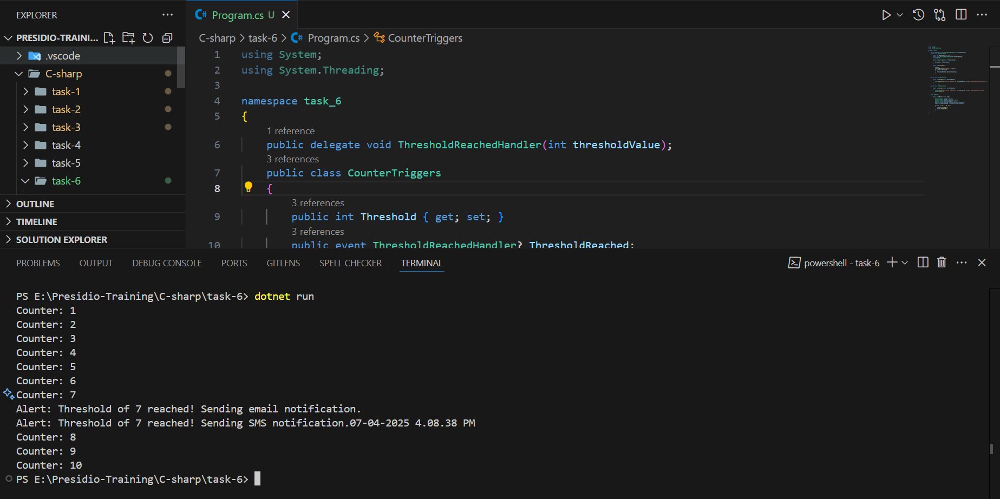

# Delegates, Events, and Basic Event Handling

## Delegates

- It is a type that defines method signature, It acts as a type safe function pointer and assign methods to delegate and invoke them later.
- Used for function pointers.

### syntax

``` c#
[modifier] delegate [return_type][delegate_name]([parameter_list])
```

## Events

- It is a speicla type of delegate, it is used for signal thaat something has happened.
- It is a mechanism for communication between objects.

### syntax

``` c#
[access_modifier] event [delegate_type] [event_name];
```

## Combination of Delegate and Event

1. Declare the delegate
2. Declare the Event
3. Attach the event (Subscribe)
4. Trigger the Event

_When the event is trigger the methods subscribed are executed along with that._

## Multi casting of a delegate

- It is an extension of normal delegate, it helsp to point more than one method in a single call.


## Program

``` c#
using System;
using System.Threading;

namespace task_6
{
    public delegate void ThresholdReachedHandler(int thresholdValue);
    public class CounterTriggers
    {
        public int Threshold { get; set; }
        public event ThresholdReachedHandler? ThresholdReached;
        int count = 0;

        public CounterTriggers(int thresholdValue)
        {
            Threshold = thresholdValue;
        }

        public void Increment()
        {
            count++;
            Console.WriteLine($"Counter: {count}");
            if (count == Threshold)
            {
                ThresholdReached?.Invoke(Threshold);
            }
        }
    }

    public class MailNotification
    {
        public void ShowAlert(int thresholdValue)
        {
            Console.WriteLine($"Alert: Threshold of {thresholdValue} reached! Sending email notification.");
        }
    }

    public class SMSNotification
    {
        public void ShowAlert(int thresholdValue)
        {
            Console.WriteLine($"Alert: Threshold of {thresholdValue} reached! Sending SMS notification.{DateTime.Now}");
        }
    }
    class Program
    {
        static void Main(string[] args)
        {
            CounterTriggers counter = new(7);
            MailNotification mailNotification = new();
            SMSNotification smsNotification = new();
            counter.ThresholdReached += mailNotification.ShowAlert;
            counter.ThresholdReached += smsNotification.ShowAlert;

            for (int i = 0; i < 10; i++)
            {
                counter.Increment();
                Thread.Sleep(1000);
            }
        }
    }
}

```

## Explanation 

- `public delegate void ThresholdReachedHandler(int thresholdValue);` - Declare the delegate with a parament of threshold.
- Created a `CounterTriggers` to increment the counter and also triggers the notification when it reaches the threshold.
- `public int Threshold { get; set; }` - Define a threshold to register the level of threshold.
- `public event ThresholdReachedHandler? ThresholdReached;` - Created a event with a delegate type of `ThresholdReachedHandler`.
- `Increment` - This method helps to increment the count and compare the current value of count with threshold to trigger the event.
- `public class MailNotification` - Created a separate service as class which contains a method ShowAlert.
- `public class SMSNotification` - Created an another service to send a sms alert.
- `CounterTriggers counter = new(5);` - Inside a main function `CounterTriggers` instance is created by passing the threshold level.
- `MailNotification mailNotification = new();` - Create a instance for mail notification.
- `SMSNotification smsNotification = new();` - Created a instance for sms notification.
- `counter.ThresholdReached += mailNotification.ShowAlert;` - Subscribe the mailNotification's ShowAlert method.
- `counter.ThresholdReached += smsNotification.ShowAlert;`  Subscribe the another method which is smsNotification's ShowAlert.
- Iterate the counter Increment with 1 second delay.


## Output




