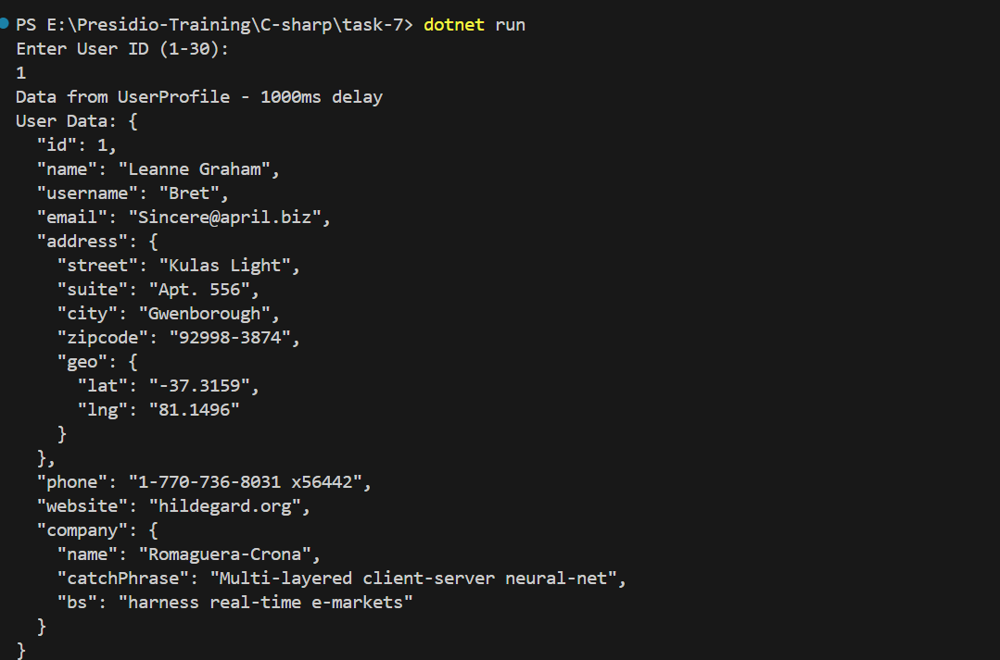
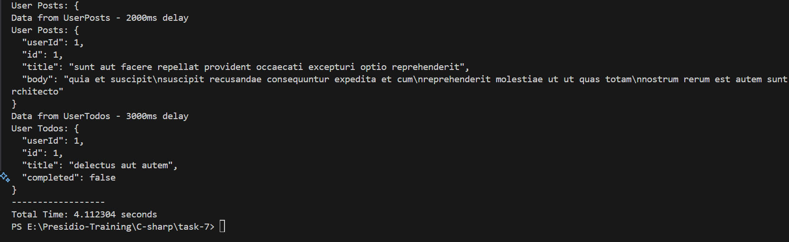
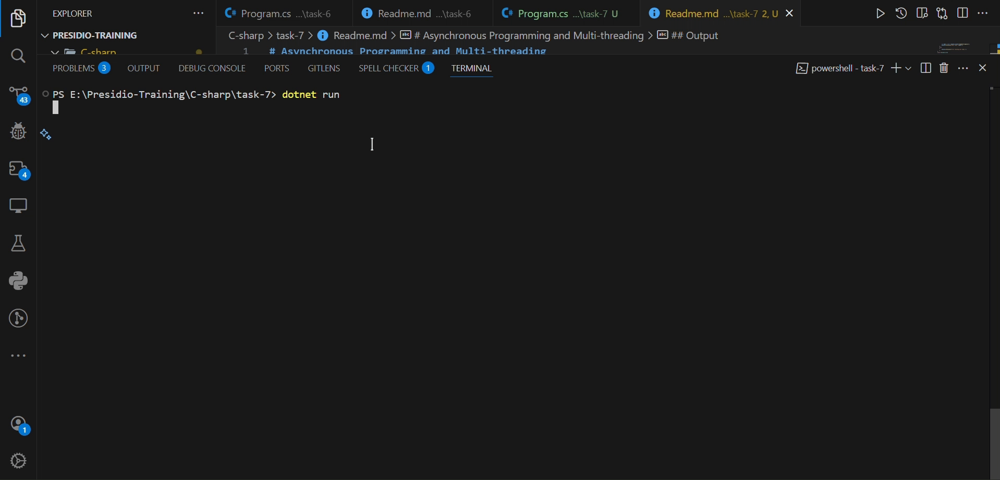

# Asynchronous Programming and Multi-threading

- Created a Console application, where it fetch all the data from external api simultaneously with certain time delay.

## Asynchronous Programming

- It means a `Parallel Programming` in which a unit of work runs separately from main application.
- `Async` and `await` keyword make a method to process with `asynchronously`.
- `await` keyword is used to pause the execution of the async method until the awaited task is completed.


### syntax

``` c#

public async Task <return type> MethodName(){
    await someAsyncOperation;
}

```

## Multithreading

- Multithreading in C# is the process of running multiple threads in parallel, where each thread executes a separate part of the program concurrently, allowing for better utilization of system resources and improving the performance.

## Program

- Declared the Main method with a async.
- `Stopwatch stopwatch = new Stopwatch();` use a stop watch class from `System.Diagnostics` to calculate the time taken for the execution of async method with all the fetch function.
- Ask for the id from used to render the data dynamically from api.
- Added three jsonplaceholder api - `users`, `posts`, `todos`.
- use a `List` collection to store the function call in a single bundled unit.
- `await Task.WhenAll(FetchingTasks);` - used await multiple asynchronous tasks and `Task.WhenAll` - is used to run multiple asynchronous tasks concurrently and wait for all of them to complete.
- `try` and `catch` helps to handles an exception raises during the execution.
- once the stop watch is stopped, `stopwatch.Elapsed.TotalSeconds` - is used to get the time take seconds.

``` c#
static async Task Main(string[] args)
        {
            Stopwatch stopwatch = new Stopwatch();
            stopwatch.Start();
            Console.WriteLine("Enter User ID (1-30): ");
            string? userId = int.TryParse(Console.ReadLine(), out int id) ? id.ToString() : null;

            if (userId == null)
            {
                Console.WriteLine("Invalid User ID.");
                return;
            }

            string userDataUrl = $"https://jsonplaceholder.typicode.com/users/{id}";
            string userPostsUrl = $"https://jsonplaceholder.typicode.com/posts/{id}";
            string userTodosUrl = $"https://jsonplaceholder.typicode.com/todos/{id}";


            try
            {
                var FetchingTasks = new List<Task>
                {
                    FetchUserData(userDataUrl),
                    FetchUserPosts(userPostsUrl),
                    FetchUserTodos(userTodosUrl)
                };

                await Task.WhenAll(FetchingTasks);
            }
            catch (Exception ex)
            {
                Console.WriteLine($"An error occurred: {ex.Message}");
            }

            stopwatch.Stop();
            Console.WriteLine("------------------");
            Console.WriteLine($"Total Time: {stopwatch.Elapsed.TotalSeconds} seconds");
        }
```

- Declared the `FetchUserData` async method.
- `using HttpClient client = new HttpClient();` - is creating a new instance of HttpClient and the `using` statement to ensure that the HttpClient instance is disposed of when it is no longer needed. `HttpClient` is used to send HTTP requests and receive HTTP responses from a resource.
- `await Task.Delay(1000);` - Delay the thread of execution for about 1 sec.
- `await client.GetAsync(url);` - Get the response by using GetAsync method.
- if the response returns with a success then the Content is read by `ReadAsStringAsync`.
- Handled the program with exception handling.

``` c#
static async Task FetchUserData(string url)
        {
            using HttpClient client = new HttpClient();
            try
            {
                await Task.Delay(1000);
                Console.WriteLine("Data from UserProfile - 1000ms delay");

                var response = await client.GetAsync(url);
                if (response.IsSuccessStatusCode)
                {
                    var data = await response.Content.ReadAsStringAsync();
                    Console.WriteLine($"User Data: {data}");
                }
                else
                {
                    Console.WriteLine("Error fetching user data.");
                }
            }
            catch (Exception ex)
            {
                Console.WriteLine($"Exception in FetchUserData: {ex.Message}");
            }
        }
```

- Declared `FetchUserPosts` async method.
- await the thread of execution to 2 sec.
- read the content if the response is returned with success status code.

``` c#
static async Task FetchUserPosts(string url)
        {
            using HttpClient client = new HttpClient();
            try
            {
                await Task.Delay(2000);
                Console.WriteLine("Data from UserPosts - 2000ms delay");

                var response = await client.GetAsync(url);
                if (response.IsSuccessStatusCode)
                {
                    var data = await response.Content.ReadAsStringAsync();
                    Console.WriteLine($"User Posts: {data}");
                }
                else
                {
                    Console.WriteLine("Error fetching user posts.");
                }
            }
            catch (Exception ex)
            {
                Console.WriteLine($"Exception in FetchUserPosts: {ex.Message}");
            }
        }
```

- Declared `FetchUserTodos` async method.
- Delayed the thread of execution by 3 sec.
- Get the response content if it is returned with success status code.

``` c#
  static async Task FetchUserTodos(string url)
        {
            using HttpClient client = new HttpClient();
            try
            {
                await Task.Delay(3000);
                Console.WriteLine("Data from UserTodos - 3000ms delay");

                var response = await client.GetAsync(url);
                if (response.IsSuccessStatusCode)
                {
                    var data = await response.Content.ReadAsStringAsync();
                    Console.WriteLine($"User Todos: {data}");
                }
                else
                {
                    Console.WriteLine("Error fetching user todos.");
                }
            }
            catch (Exception ex)
            {
                Console.WriteLine($"Exception in FetchUserTodos: {ex.Message}");
            }
        }
```


## Output





