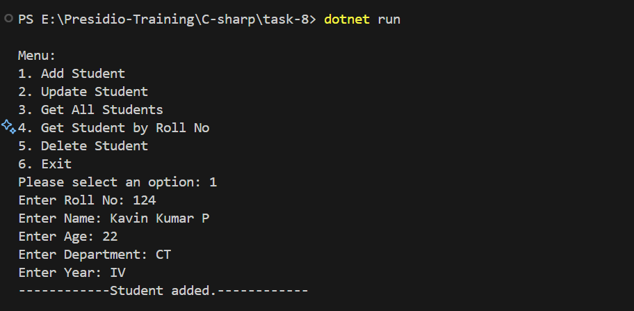
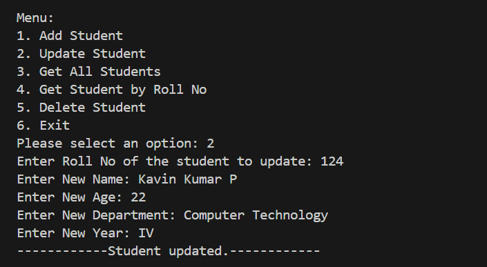
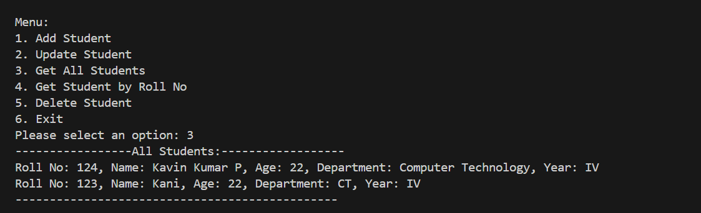
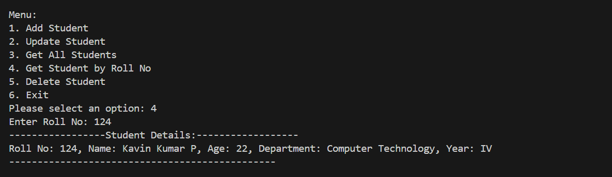
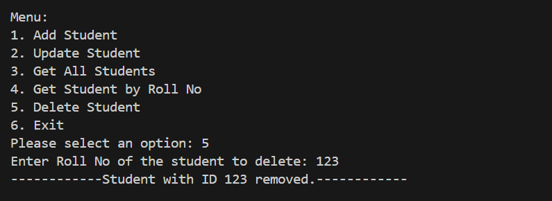

# Generics and Interfaces with a Repository Pattern

- Created an console app for managing the students information by using a `Repository Pattern and Generic type`.

## Models

- It is a class that represent the structure of data in the application.
- In this Console app, Student class was created under model which contains property like

  - RollNo
  - Name
  - Age
  - Department
  - Year

- These are under the Models namespace.

## Interface

- It is a contract that defines the set of methods and properties.
- It does not contain any implementation only a set of rules.
- In this console app, `IRepository` is created under the `repositories` folder which defines methods like

  - `Add`
  - `GetById`
  - `Update`
  - `Delete`
  - `GetAll`

- Make this repository as generics which will act as a universal type and suitable for user defined class.
- `where T : class` - This constraint ensures that the T type parameter can only be a reference type, not a value type.
- `<T>` -  Makes a `generic` type.

## Program

- Models- Created a `Student` Model.

```c#
namespace Models
{
    public class Student(int rollNo, string? name, int age, string? department, string? year)
    {
        public int RollNo { get; set; } = rollNo;
        public string? Name { get; set; } = name;
        public int Age { get; set; } = age;
        public string? Department { get; set; } = department;
        public string? Year { get; set; } = year;

    }
}
```

- Defined a Interface in a repository folder with some common method and `<T>` - a generic type parameter which makes the `generic interface`.
- This make to work with `any type of objects.`

```c#

using System.Collections.Generic;
using Models;

namespace GenericRepository
{
    public interface IRepository<T> where T : class
    {
        void Add(T entity);
        T GetById(int id);
        void Update(T entity);
        void Delete(int id);
        IEnumerable<T> GetAll();
    }

}
```

- Generic class is declared and `implements` the `IRepository` interface.
- Created a private readonly list to store the data.
- Declared a function and implements its logic
- `Add` - Check the index is already present in the entity, then `InvalidOperationException` is thrown.

- `GetAll` - Helps to return the complete list present inside that class with a type `IEnumerable`.

- `GetById` - Help to return the specific student object based on id.

- `Update` - Helps to update the list with its unique index and also handled the exception with `KeyNotFoundException`.

- `Delete` - Helps to remove the specific entity by its id.

```c#
using System;
using System.Collections.Generic;
using System.Linq;
using GenericRepository;

namespace InMemoryRepository
{

    public class Repository<T> : IRepository<T> where T : class
    {
        private readonly List<T> _items = new List<T>();
        public void Add(T entity)
        {
            var index = _items.FindIndex(e => e.Equals(entity));
            if (index != -1)
            {
                throw new InvalidOperationException("Entity already exists.");
            }
            _items.Add(entity);
            Console.WriteLine($"{typeof(T).Name} added.");
        }
        public IEnumerable<T> GetAll()
        {
            return _items;
        }
        public T GetById(int id)
        {
            var entity = _items.FirstOrDefault(
                e => e.GetType().GetProperty("RollNo")?.GetValue(e, null)?.Equals(id) == true
            ) ??
                throw new KeyNotFoundException($"Entity with the specified ID not found.");

            return entity;
        }
        public void Update(T entity)
        {
            var index = _items.FindIndex(e => e.Equals(entity));
            if (index == -1)
            {
                throw new KeyNotFoundException("Entity not found.");
            }
            _items[index] = entity;

            Console.WriteLine($"{typeof(T).Name} updated.");
        }

        public void Delete(int id)
        {
            var entity = GetById(id);
            if (entity != null)
            {
                _items.Remove(entity);
                Console.WriteLine($"{typeof(T).Name} with ID {id} removed.");
            }
            else
            {
                throw new KeyNotFoundException("Entity not found.");
            }
        }
    }
}

```

- Inside a Main method a new `Repository` is created with a type of Student and holds the variable in `IRepository`.
- Show the menu for user by using a continuous running loop, until break.
- `case 1` - Add the user to list, for that all the info is collected.
- `case 2` - Update the user, by specific index in that entity.
- `case 3` - Get the all data present inside that list.
- `case 4` - Get the specific student by passing property of rollNo.
- `case 5` - Delete the specific student by their rollNo
- `case 6` - Exit the looping condition.

```c#
using System;
using System.Linq;
using Models;
using InMemoryRepository;
using GenericRepository;

namespace task_8
{
    class Program
    {
        static void Main(string[] args)
        {
            IRepository<Student> repository = new Repository<Student>();
            bool running = true;

            while (running)
            {
                Console.WriteLine("\nMenu:");
                Console.WriteLine("1. Add Student");
                Console.WriteLine("2. Update Student");
                Console.WriteLine("3. Get All Students");
                Console.WriteLine("4. Get Student by Roll No");
                Console.WriteLine("5. Delete Student");
                Console.WriteLine("6. Exit");
                Console.Write("Please select an option: ");
                string? userInput = Console.ReadLine();

                try
                {
                    switch (userInput)
                    {
                        case "1":
                            Console.Write("Enter Roll No: ");
                            string? rollNoInput = Console.ReadLine();
                            if (!int.TryParse(rollNoInput, out int rollNo))
                            {
                                Console.WriteLine("Invalid Roll No. Please enter a valid number.");
                                break;
                            }
                            Console.Write("Enter Name: ");
                            string? name = Console.ReadLine();
                            Console.Write("Enter Age: ");
                            string? ageInput = Console.ReadLine();
                            if (!int.TryParse(ageInput, out int age))
                            {
                                Console.WriteLine("Invalid Age. Please enter a valid number.");
                                break;
                            }
                            Console.Write("Enter Department: ");
                            string? department = Console.ReadLine();
                            Console.Write("Enter Year: ");
                            string? year = Console.ReadLine();

                            repository.Add(new Student(rollNo, name, age, department, year));
                            break;

                        case "2":
                            Console.Write("Enter Roll No of the student to update: ");
                            string? updateRollNoInput = Console.ReadLine();
                            if (!int.TryParse(updateRollNoInput, out int updateRollNo))
                            {
                                Console.WriteLine("Invalid Roll No. Please enter a valid number.");
                                break;
                            }
                            var studentToUpdate = repository.GetAll().FirstOrDefault(s => s.RollNo == updateRollNo);

                            if (studentToUpdate != null)
                            {
                                Console.Write("Enter New Name: ");
                                studentToUpdate.Name = Console.ReadLine();
                                Console.Write("Enter New Age: ");
                                string? newAgeInput = Console.ReadLine();
                                if (!int.TryParse(newAgeInput, out int newAge))
                                {
                                    Console.WriteLine("Invalid Age. Please enter a valid number.");
                                    break;
                                }
                                studentToUpdate.Age = newAge;
                                Console.Write("Enter New Department: ");
                                studentToUpdate.Department = Console.ReadLine();
                                Console.Write("Enter New Year: ");
                                studentToUpdate.Year = Console.ReadLine();

                                repository.Update(studentToUpdate);
                                Console.WriteLine("Student updated successfully.");
                            }
                            else
                            {
                                Console.WriteLine("Student not found.");
                            }
                            break;

                        case "3":
                            var allStudents = repository.GetAll();
                            Console.WriteLine("-----------------All Students:------------------");
                            if (!allStudents.Any())
                            {
                                Console.WriteLine("No students found.");
                                break;
                            }
                            foreach (var s in allStudents)
                            {
                                Console.WriteLine($"Roll No: {s.RollNo}, Name: {s.Name}, Age: {s.Age}, Department: {s.Department}, Year: {s.Year}");
                            }
                            Console.WriteLine("-----------------------------------------------");
                            break;

                        case "4":
                            Console.Write("Enter Roll No: ");
                            string? rollNoInputToGet = Console.ReadLine();
                            if (!int.TryParse(rollNoInputToGet, out int rollNoToGet))
                            {
                                Console.WriteLine("Invalid Roll No. Please enter a valid number.");
                                break;
                            }
                            var student = repository.GetById(rollNoToGet);

                            if (student != null)
                            {
                                Console.WriteLine($"Roll No: {student.RollNo}, Name: {student.Name}, Age: {student.Age}, Department: {student.Department}, Year: {student.Year}");
                            }
                            else
                            {
                                Console.WriteLine("Student not found.");
                            }
                            break;

                        case "5":
                            Console.Write("Enter Roll No of the student to delete: ");
                            string? rollNoToDeleteInput = Console.ReadLine();
                            if (!int.TryParse(rollNoToDeleteInput, out int rollNoToDelete))
                            {
                                Console.WriteLine("Invalid Roll No. Please enter a valid number.");
                                break;
                            }

                            var studentToDelete = repository.GetAll().FirstOrDefault(s => s.RollNo == rollNoToDelete);

                            if (studentToDelete != null)
                            {
                                repository.Delete(rollNoToDelete);
                                Console.WriteLine("Student deleted successfully.");
                            }
                            else
                            {
                                Console.WriteLine("Student not found.");
                            }
                            break;

                        case "6":
                            running = false;
                            Console.WriteLine("Exiting...");
                            break;

                        default:
                            Console.WriteLine("Invalid option, please try again.");
                            break;
                    }
                }
                catch (Exception ex)
                {
                    Console.WriteLine($"Error: {ex.Message}");
                }
            }
        }
    }
}
```

_Like student another class is also created with these repository._

`??` - Refers to null-coalescing operator, handles `null` values without explicit if condition

## Output










