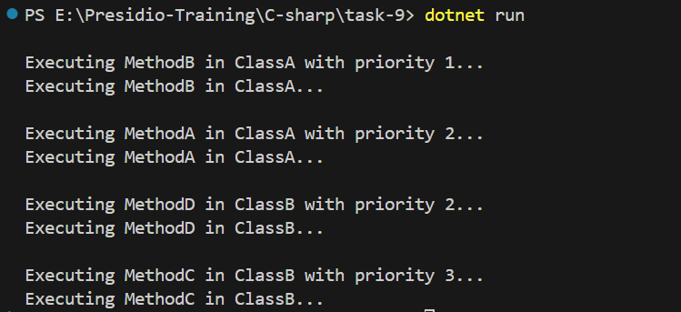

# Reflection and Custom Attribute

- Build an console application which auto execute based on the custom attribute with its priority.

## Reflection

- It allows to inspect and `manipulate` the `types, methods, properties`of the code during at the `runtime`.
- When the attribute is used in the code, Reflection enables to access them.

  | **Class Name**          | **Description**                                                                                                           |
  | ----------------------- | ------------------------------------------------------------------------------------------------------------------------- |
  | **Assembly**            | Provides methods to load, explore, and interact with assemblies and their metadata.                                       |
  | **Type**                | Represents types (classes, structs, enums, etc.) and provides methods to get metadata about them.                         |
  | **MethodInfo**          | Provides information about methods (including parameters, return type, and attributes) and allows invocation.             |
  | **PropertyInfo**        | Provides information about properties (like name, type, and access modifiers) and allows getting or setting their values. |
  | **FieldInfo**           | Provides information about fields (like name, type, and access modifiers) and allows getting or setting their values.     |
  | **ConstructorInfo**     | Represents a constructor and provides methods to obtain information about it and invoke it.                               |
  | **MemberInfo**          | Base class for `MethodInfo`, `PropertyInfo`, `FieldInfo`, and `ConstructorInfo`, providing common functionality.          |
  | **CustomAttributeData** | Provides information about custom attributes applied to members (methods, classes, etc.).                                 |
  | **ParameterInfo**       | Represents a parameter of a method or constructor and provides details about its type, name, and attributes.              |
  | **Activator**           | Provides methods to create instances of types `dynamically` at `runtime`.                                                 |
  | **BindingFlags**        | Enum that defines flags used to specify which members to search for during reflection operations.                         |
  | **MethodBase**          | Represents both methods and constructors, providing common functionality to retrieve details and invoke them.             |

## Attributes

- It is `special tags` that can apply to classes, methods, properties, field.
- It don't affect the actual execution of the program, but provide useful data that can be retrieved at the runtime.

### syntax

```c#
[AttributeUsage(AttributeTargets.Method)]
public class RunnableAttribute : Attribute
{
    //
}
```

## Program Explanation

- Created a custom attribute for methods with `[AttributeUsage(AttributeTargets.Method)]` and this is used for setting the priority of the methods.

```c#
  [AttributeUsage(AttributeTargets.Method)]
    public class RunnableAttribute : Attribute
    {
        public int Priority { get; }

        public RunnableAttribute(int priority)
        {
            Priority = priority;
        }
    }
```

- Created a `ClassA` with 2 `runnable` methods - `Method A` and `Method B`
- Set the priority by `[Runnable(2)]`

```c#
 public class ClassA
    {
        [Runnable(2)]
        public void MethodA()
        {
            Console.WriteLine("Executing MethodA in ClassA...");
        }

        [Runnable(1)]
        public void MethodB()
        {
            Console.WriteLine("Executing MethodB in ClassA...");
        }
    }
```

- Created a another class `ClassB` with 3 methods - 2 runnable and 1 static methods.

```c#
 public class ClassB
    {
        [Runnable(3)]
        public void MethodC()
        {
            Console.WriteLine("Executing MethodC in ClassB...");
        }

        [Runnable(2)]
        public void MethodD()
        {
            Console.WriteLine("Executing MethodD in ClassB...");
        }

        public static void MethodF()
        {
            Console.WriteLine("Executing MethodF in ClassB...");
        }
    }
```

- Created a Main function and retrieves all the types (`classes`, `structs`, etc.) defined in the currently executing assembly.
- Created a `runnableMethods` variable to store the runnable public methods that are declared in this file.
- Sort the flow using `order by`.
- Convert to list for iterable.
- Iterate over the `runnableMethods` and create a `new Instance dynamically during at runtime`- `Activator.CreateInstance(methodInfo.Type);`
- `methodInfo.Method.Invoke(instance, null);` - Helps to invoke the method during at the runtime.

```c#

    class Program
    {
        static void Main(string[] args)
        {
            var types = Assembly.GetExecutingAssembly().GetTypes();
            var runnableMethods = types
                .SelectMany(type => type.GetMethods(BindingFlags.Public | BindingFlags.Instance | BindingFlags.DeclaredOnly)
                    .Where(m => m.GetCustomAttribute<RunnableAttribute>() != null)
                    .Select(m => new
                    {
                        Method = m,
                        Type = type,
                        Priority = m.GetCustomAttribute<RunnableAttribute>()?.Priority
                    }))
                .OrderBy(method => method.Priority)
                .ToList();

            foreach (var methodInfo in runnableMethods)
            {
                var instance = Activator.CreateInstance(methodInfo.Type);
                Console.WriteLine($"\nExecuting {methodInfo.Method.Name} in {methodInfo.Type.Name} with priority {methodInfo.Priority}...");
                methodInfo.Method.Invoke(instance, null);
            }
        }
    }
```

## Output

