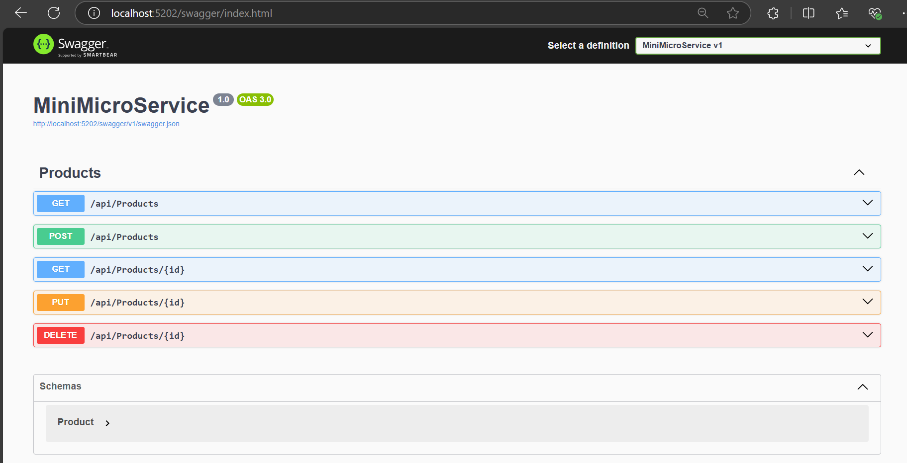
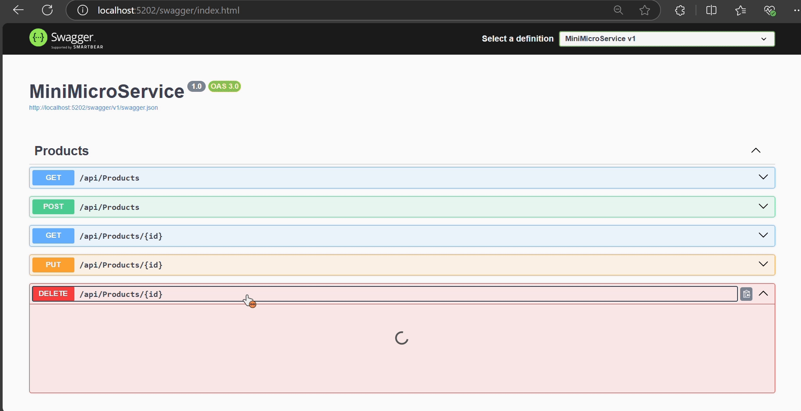
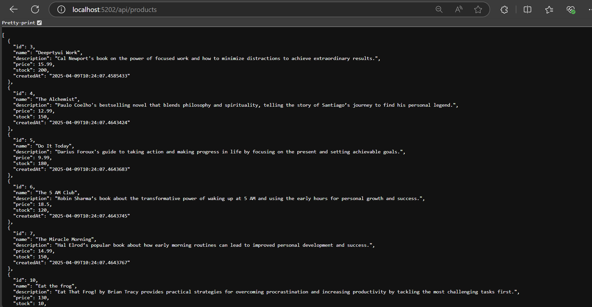

# Building a Mini Microservice with ASP.NET Core

- Created a small Restful api that manages the books data using the web api SP.Net and Sqlite Database.

## MicroService

- A microservice is a `software architecture` style that structures an application as a collection of small, loosely coupled, independently deployable services.

- Each microservice focuses on a specific business functionality and communicates with other microservices over a network protocols.

## SQLite Database

- SQLite is a serverless, self-contained, zero-configuration, and transactional database engine.
- It is a `file-based database`. This means the entire database (data, schema, indices, etc.) is stored in a single file.

## Steps

**1. Create a new Web Api project using by Vs code UI or by command.**

```c#
dotnet new webapi -n Service_name
```

**2. Install a Entity Framework core packages, swagger integration packages.**

```c#
dotnet add package Microsoft.EntityFrameworkCore
dotnet add package Microsoft.EntityFrameworkCore.Tools
dotnet add package Microsoft.EntityFrameworkCore.Design
dotnet add package Microsoft.EntityFrameworkCore.Sqlite
dotnet add package Swashbuckle.AspNetCore
```

**3.Create a model to store the structure of the product (Id, Name, Description, Price, Stock, CreatedAt).**

```c#
    namespace MiniMicroservice.Models
    {
        public class Product
        {
            public int Id { get; set; }
            public string Name { get; set; } = null!;
            public string Description { get; set; } = null!;
            public decimal Price { get; set; }
            public int Stock { get; set; }
            public DateTime CreatedAt { get; set; } = DateTime.UtcNow;
        }
    }
```

**4. Created a Db context which is a `Object relational Mapping tool`.**

- It act as bridge between database and application.

- Set the Constructor Dependency Injection for configuring with database.

```c#
using Microsoft.EntityFrameworkCore;
using MiniMicroservice.Models;

namespace MiniMicroservice.Data
{
    public class AppDbContext : DbContext
    {
        public AppDbContext(DbContextOptions<AppDbContext> options) : base(options)
        {

        }

        public DbSet<Product> Products { get; set; } = null!;
    }
}
```

**5. Create a Sqlite Db using the command.**

- Before creation of db,
- `dotnet restore`: Restores the NuGet packages required for the project, ensuring dependencies are available.

- `dotnet build`: Compiles the source code into executable files, preparing the project for running or deployment.

- Once all the build is successful, then create a db using

  - `dotnet tool install --global dotnet-ef` - ef core tools.

  - `dotnet ef migrations add InitialCreate`- Created a initial migration.

  - `dotnet ef database update` - Created a products.db file in the root directory.

**6. Create a Controller and Endpoints routes.**

- It handles incoming HTTP requests, processes them, and returns an appropriate HTTP response.
- Helps to update `model` and `view`.

```c#
using Microsoft.AspNetCore.Mvc;
using Microsoft.EntityFrameworkCore;
using MiniMicroservice.Data;
using MiniMicroservice.Models;
```

- Use a namespace related to MVC (model-view-controller)
- Data and model names space are also imported.

```c#
namespace MiniMicroservice.Controllers
{
    [Route("api/[controller]")]
    [ApiController]
    public class ProductsController : ControllerBase
    {
        private readonly AppDbContext _context;
        public ProductsController(AppDbContext context)
        {
            _context = context;
        }
    }
}
```

- `[Route("api/[controller]")]` - It is a route template fot API, and the `controller` is replaced dynamically by the `controller name`.
- [ApiController] - It is a attribute that is used to designate a class as a Web API controller, that handles the validation logic, and improves the routing performance.
- `ProductsController` - It inherits the ControllerBase for using the feature from that class.
- `ProductsController constructor` - helps to inject `AppDbContext` into the `controller`.

```c#
 [HttpGet]
        public async Task<ActionResult<IEnumerable<Product>>> GetProducts()
        {
            return await _context.Products.ToListAsync();
        }
```

- `[HttpGet]` - This attribute defines the action that represents to get the http response.
- `ActionResult` - It is return type which indicates either success or failure response is returned, in controller all the endpoints have a ActionResult return type.
- `IEnumerable<Product>` - Products is return in the format of Iterable.

```c#
[HttpGet("{id}")]
        public async Task<ActionResult<Product>> GetProduct(int id)
        {
            var product = await _context.Products.FindAsync(id);

            if (product == null)
            {
                return NotFound();
            }

            return product;
        }
```

- `[HttpGet("{id}")]` - To get the specified response based on the id.
- `FindAsync` - Helps to look a data in the response based on the id of the product.
- If the product is not found then return a `NotFound` - HTTP 404. Otherwise return a product.

```c#
 [HttpPost]
        public async Task<ActionResult> CreateProduct([FromBody] List<Product> products)
        {

            _context.Products.AddRange(products);
            await _context.SaveChangesAsync();

            return return Ok(products);
        }
```

- `[HttpPost]` - This attribute helps to send a HTTP post request.
- `[FromBody] - Tells to ASP.NET to accept the incoming data from the body of the HTTP request.
- `Products.AddRange` - Add a bulk range of products to the list.
- `return Ok(products);` - returned a OK status code with products response.

```c#
 [HttpPut("{id}")]
        public async Task<IActionResult> UpdateProduct(int id, Product product)
        {
            if (id != product.Id)
            {
                return BadRequest();
            }

            _context.Entry(product).State = EntityState.Modified;

            try
            {
                await _context.SaveChangesAsync();
            }
            catch (DbUpdateConcurrencyException)
            {
                if (!ProductExists(id))
                {
                    return NotFound();
                }
                else
                {
                    throw;
                }
            }

            return NoContent();
        }
```

- `[HttpPut("{id}")]` - This attribute helps to make a Put request along with its id.
- `_context.Entry(product).State = EntityState.Modified;` - This marks the product as modified in the entity framework.
- `DbUpdateConcurrencyException` - Avoids the concurrency edit from different user.
- `NoContent` - After success does not return a any content as response.

```c#

        [HttpDelete("{id}")]
        public async Task<IActionResult> DeleteProduct(int id)
        {
            var product = await _context.Products.FindAsync(id);
            if (product == null)
            {
                return NotFound();
            }

            _context.Products.Remove(product);
            await _context.SaveChangesAsync();

            return NoContent();
        }
```

- `[HttpDelete("{id}")]` - Make a delete api end point request along with its id.
- Find that product, and remove from the db `Products.Remove`.
- Once removed NoContent tells, the request is success but no content is returned.

## MiddleWare

- MiddleWare is like a series of gates that every HTTP request goes through.


```c#
using Microsoft.AspNetCore.Http;
using Microsoft.Extensions.Logging;
using System;
using System.Net;
using System.Text.Json;
using System.Threading.Tasks;

namespace MiniMicroservice.Middleware
{
    public class ExceptionHandlingMiddleware
    {
        private readonly RequestDelegate _next;
        private readonly ILogger<ExceptionHandlingMiddleware> _logger;

        public ExceptionHandlingMiddleware(RequestDelegate next, ILogger<ExceptionHandlingMiddleware> logger)
        {
            _next = next;
            _logger = logger;
        }

        public async Task Invoke(HttpContext context)
        {
             _logger.LogInformation("ExceptionHandlingMiddleware activated");
            try
            {
                await _next(context);
            }
            catch (Exception ex)
            {
                _logger.LogError(ex, "An unhandled exception occurred");

                context.Response.StatusCode = (int)HttpStatusCode.InternalServerError;
                context.Response.ContentType = "application/json";

                var response = new
                {
                    StatusCode = context.Response.StatusCode,
                    Message = "An unexpected error occurred. Please try again later.",
                    Detailed = ex.Message
                };

                var json = JsonSerializer.Serialize(response);

                await context.Response.WriteAsync(json);
            }
        }
    }
}
```

- `RequestDelegate _next` - Reference to next part in the pipeline.
- `ILogger<ExceptionHandlingMiddleware> _logger` - Log the Information and Debug.
- `HttpContext` - Runs for every single HTTP request.
- Created a Object error and convert that into json using `JsonSerializer.Serialize(response)` and written back to the response.

- `ExceptionMiddlewareExtensions.cs` - This file makes it easy way for importing MiddleWare to the main entry point.

## What is Swagger

- It is a suite of open source tools and a specification used to design, document and consume restful api.
- It is used to created a interactive, machine readable API documentation.

### Use Cases

| **Use Case**            | **Description**                                                                   |
| ----------------------- | --------------------------------------------------------------------------------- |
| **API Design**          | Use Swagger Editor to design and document APIs.                                   |
| **API Documentation**   | Generate interactive documentation using Swagger UI.                              |
| **API Testing**         | Test API endpoints directly within Swagger UI.                                    |
| **API Code Generation** | Use Swagger Codegen to generate server stubs and client libraries.                |
| **API Consumption**     | Developers can easily understand and consume APIs based on Swagger documentation. |

## Action return types

### Common Action Return Types in C#

| **Return Type**    | **Description**                                                                                                                       |
| ------------------ | ------------------------------------------------------------------------------------------------------------------------------------- |
| **Ok()**           | Returns a 200 OK status code, typically used to indicate successful data retrieval or operation.                                      |
| **Created()**      | Returns a 201 Created status code, usually used after creating a new resource.                                                        |
| **NoContent()**    | Returns a 204 No Content status code, indicating that the request was successful but there is no content in the response.             |
| **BadRequest()**   | Returns a 400 Bad Request status code, indicating that the request is invalid.                                                        |
| **NotFound()**     | Returns a 404 Not Found status code, indicating that the requested resource could not be found.                                       |
| **Unauthorized()** | Returns a 401 Unauthorized status code, indicating that the request requires authentication.                                          |
| **Forbidden()**    | Returns a 403 Forbidden status code, indicating that the server understood the request but refuses to authorize it.                   |
| **Conflict()**     | Returns a 409 Conflict status code, indicating that the request could not be completed due to a conflict with the current state.      |
| **Accepted()**     | Returns a 202 Accepted status code, indicating that the request has been accepted for processing, but the processing is not complete. |
| **NoContent()**    | Returns a 204 No Content status code, indicating that the request was successful but there is no content in the response.             |
| **Redirect()**     | Returns a 302 Redirect status code, used to redirect the client to a different URL.                                                   |

## Output

- Swagger



- Get Method


- Post method to insert data


- Get method by id


- Update the data by put request


- Delete the Product



- Response in browser


